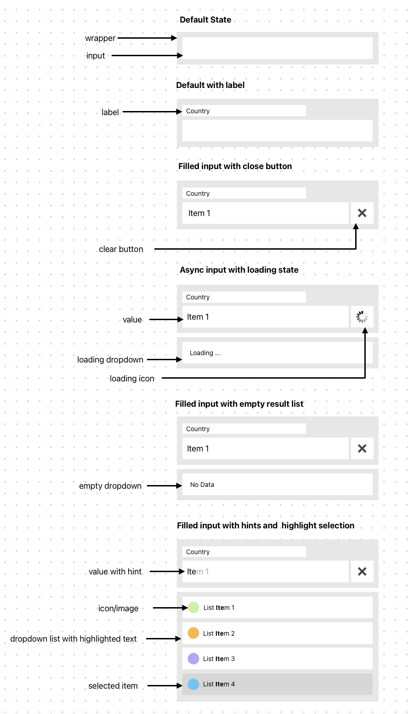
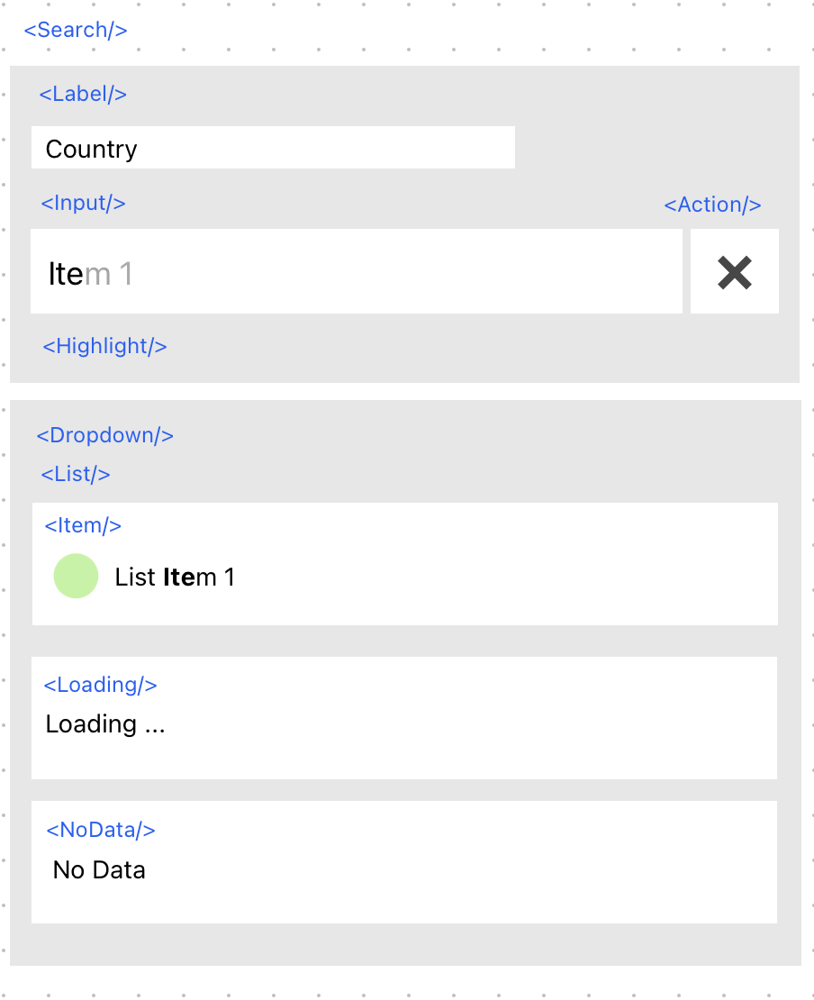

## Search

Essential functionalities of the Search component implemented in the code. Each aspect demonstrates the logic necessary for optimal user experience.



Here is the structure of the Search component displayed



## How to Run a Project

- Make sure you have installed Node.js v12.0.0 or higher.
- Install project dependencies by running the following command:
    ```code
    npm install
- After the installation is complete, you can start the development server by running:
    ```code
    npm run dev
- To check the production version build and bundle size, execute the command:   
    ```code
    npm run build